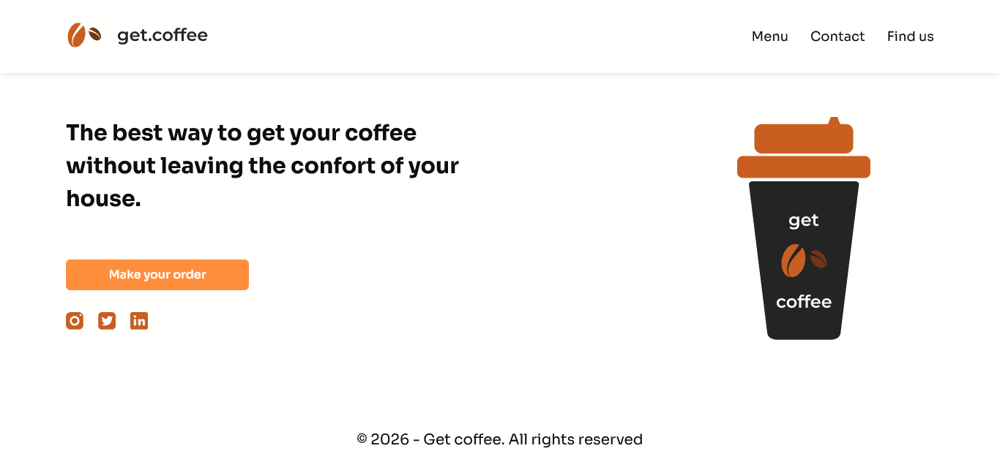

## GET COFFEE ☕ | LANDING PAGE

## Le challenge

Création d'une landing page en HTML5, CSS3 et JavaScript.

## Démonstration

Lien vers le projet : https://aperbet56.github.io/get_coffee_landing_page/

## Projet développé avec

- Utilisation des balises sémantiques HTML5
- CSS3
- Flexbox
- Animations CSS (transition)
- Desktop first
- Page web responsive
- Commentaires HTML
- Commentaires CSS
- Utilisation d'un normaliseur : le fichier normalize.css
- Importation de la police "Sora"
- JavaScript
- Code JavaScript commenté
